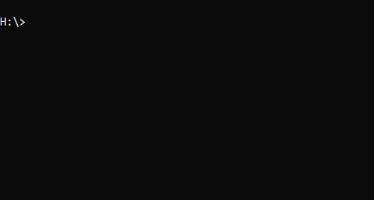

# any-year-calendar

- This is a Calendar utility program written in C programing language.
- This program can show a calender for any date.
- This program can also tell what day it would be for any date.
- The calendar's look is based on the calendar you see when running the Linux cal command.
